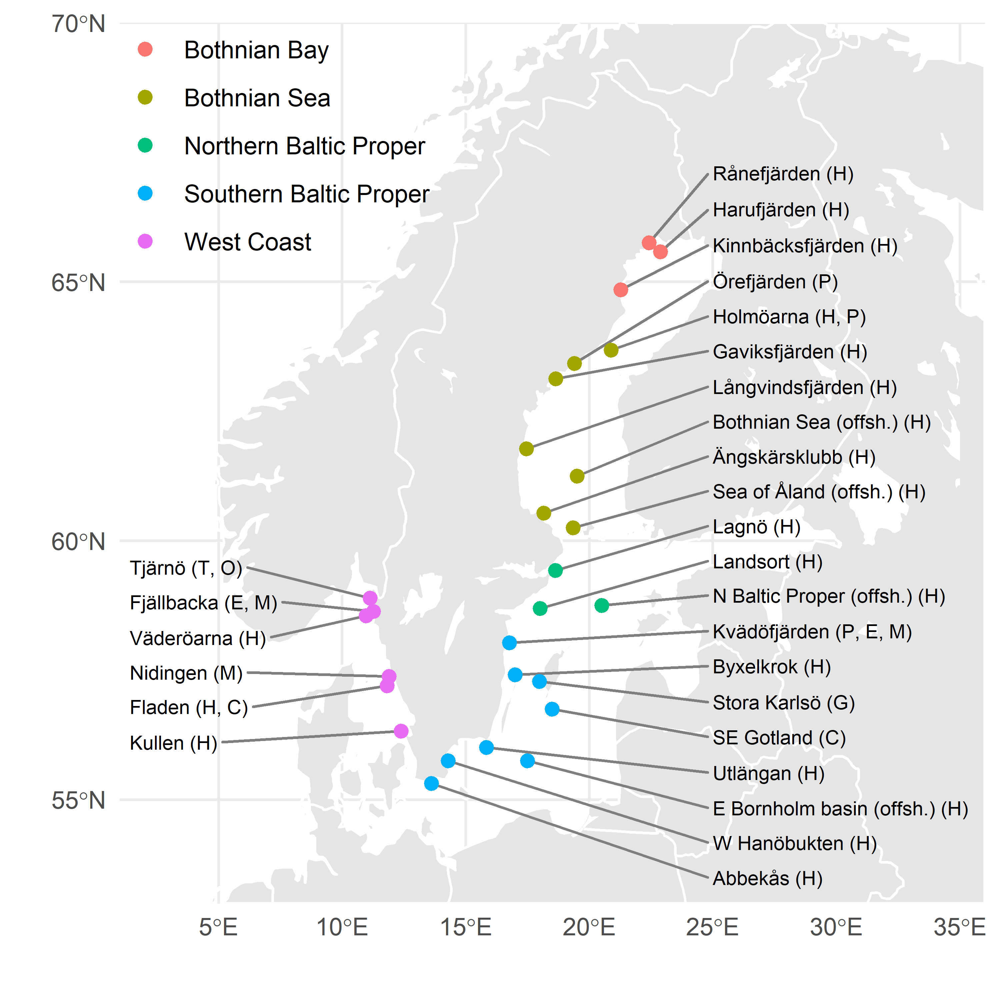

```{r setup, include=FALSE}
knitr::opts_chunk$set(echo = TRUE, message = FALSE)
library(tidyverse)
```

# Basins and localities

The sampling localities and their divisions into basins are described in Figure 1, additional information on data collection and analysis can be found in Danielsson et.al. (2019).

```{r, fig.cap="Sampling localities, basins and species collected (H: Herring, C: Cod, P: Perch, E: Eelpout, M: Blue Mussel, G: Guillemot, T: Commen Tern, O: Eurasian Oystercatcher)", echo=FALSE}

```


# Description of statistical summaries

The table on the first tab of the web-app contains a number of statistical summaries at the locality and basin levels. Note that the app does not check whether statistical assumptions, such as independence, homoscedasiticity and normal distribution on the log-scale, are valid. Since many of the summaries are only valid or useful under these assumptions, care should be taken to perform a proper residual analysis before drawing further conclusions based on their values.

As the basis of the statistical analyses, yearly indices are computed as geometric means of observed concentrations for each contaminant, locality and species. To investigate possible trends, linear regressions are then fitted to their log-transformed values. A full description of the values presented in the tabel is given as follows, complemented by R-code reproducing the results for silver (Ag) at locality Abbekås from 2005 to 2018. Data for the reproducing example is loaded by

```{r}
data <- read_csv("aggdata.csv", guess_max = 50000) %>% 
  filter(YEAR >= 2005, basin == "Southern Baltic Proper", art == "Herring", var == "AG")
```


## Yearly change (%)

For localities, this equals $100(e^\beta-1)$, where $\beta$ is the slope of the regression line fitted to the log-indices. In R computed as
```{r}
modell_ABBE <- lm(log(value) ~ YEAR, data = filter(data, LOC == "ABBE"))
beta_ABBE <- coef(modell_ABBE)["YEAR"]
rate_ABBE <- 100 * (exp(beta_ABBE) - 1)
rate_ABBE
```
For basins, Southern Baltic Proper in our example,  a multiple linear regression is fitted to the log-indices for all localities with a common slope but possibly different intercepts. In R
```{r}
modell_SBP <- lm(log(value) ~ YEAR + LOC, data = data)
beta_SBP <- coef(modell_SBP)["YEAR"]
rate_SBP <- 100 * (exp(beta_SBP) - 1)
rate_SBP
```


## Confidence interval (95%)

These are $t$-based confidence intervals for the slopes transformed to the rate-scale. While the yearly change value may be a reasonable summary regardless of the validity of model assumptions, these intervals are intimately linked to the standard assumptions of a normal linear regression model (for basins, also the assumption of equal slopes). In R computed as
```{r}
CI_beta_ABBE <- confint(modell_ABBE)["YEAR", ]
CI_ABBE <- 100 * (exp(CI_beta_ABBE) - 1)
CI_ABBE
```
for Abbekås and for Southern Baltic Proper
```{r}
CI_beta_SBP <- confint(modell_SBP)["YEAR", ]
CI_SBP <- 100 * (exp(CI_beta_SBP) - 1)
CI_SBP
```

## Predicted value 2018

This is simply a prediction of the mean value in 2018, that is of $\exp(\alpha + \beta 2018)$ where $\alpha$ is the intercept of the regression line. In R for Abbekås
```{r}
alpha_ABBE <- coef(modell_ABBE)["(Intercept)"]
pred2018_ABBE <- exp(alpha_ABBE + beta_ABBE * 2018)
pred2018_ABBE
```
For the basins, we need to compute an average intercept over localities. This is done by a weighted average, where the weight of each locality is proportional to the standard error of its intercept estimate. In R computed as

```{r}
theta_SBP <- coef(modell_SBP)
d <- length(theta_SBP)
D <- cbind(1, diag(d - 1))
D[1, 2] <- 0
intercepts <- t(D %*% theta_SBP)
Sigma <- D %*% vcov(modell_SBP) %*% t(D)
w <- diag(Sigma)
alpha_SBP <- sum(intercepts/w)/sum(1/w)
pred2018_SBP <- exp(alpha_SBP + beta_SBP * 2018)
pred2018_SBP
```


## p-value equal slopes

An important assumption of the regressions at the basin level is that of equal slopes among the localities. To aid in the assessment of this assumption we here present a $p$-value for an $F$-based test of the hypoteses that the slopes are equal. Very small values would here suggest that there may be differences in slopes and hence that the model underpinning the basin level analysis may be invalid. In R for Southern Baltic Proper
```{r}
modell_SBP_alternative <- lm(log(value) ~ YEAR * LOC, data = data)
aov_table <- anova(modell_SBP, modell_SBP_alternative)
p_value <- aov_table$"Pr(>F)"[2]
p_value
```


## Power vs 10% inc.

Here an estimate of the probability to detect a 10% increasing trend at a significance level of 5% is presented. In the context of the table, detecting a trend here corresponds to observing a confidence interval for the rate with a lower limit greater than zero. The value is computed as $F_{\delta, d}(t_{0.025, d})+(1 -F_{\delta, d}(t_{0.975, d}))$, where  $F_{\delta, d}$ is the distribution function of the non-central $t$-distribution with $d$ degrees of freedom and $t_{p, d}$ is the quantile function for the (central) $t$-distribution. The non-centrailty parameter is taken as $\delta=\log(1.1)/se(\hat{\beta})$, where $se(\hat{\beta})$ is a standard error for the slope estimate. In R for Southern Baltic Proper

```{r}
slope_se <- sqrt(vcov(modell_SBP)["YEAR", "YEAR"])
df <- modell_SBP$df
pt(qt(.025,  df), ncp = log(1.1)/slope_se, df = df) + 
  (1 - pt(qt(.975, df), ncp = log(1.1)/slope_se, df = df))
```

## Limit

For calculation of limits, see Danielsson et.al. (2019).

## Time to limit (years)

If the estimated trend is heading towards the limit, this equals $(\log(lim)-\alpha)/\beta -2018$ as an estimate of the number of years it will take to reach the limit at the observed trend.

## n obs

Number of obsvervations used in the regression analysises.

## n all < LOD

When the concentration is below the limit of detection, its value is computed as the limit divided by the square root of two, see Danielsson et.al. (2019). This column denotes the number of years where all values were below LOD. When many values are below LOD, an observed trend may be the result of a trend in LOD-values rather than a trend in concentrations.


# Reference

Sara Danielsson, Caroline Ek, Suzanne Faxneld and Kerstin Winkens Pütz, 2019, *The Swedish National Monitoring Programme for
Contaminants in marine biota (until 2017 year’s data) – Temporal trends and spatial variations.*


